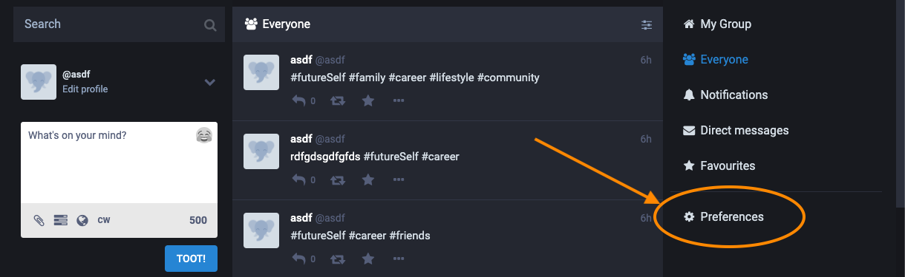
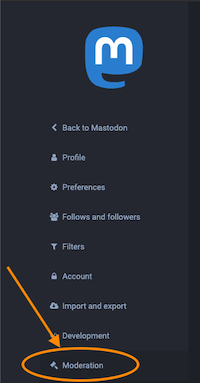
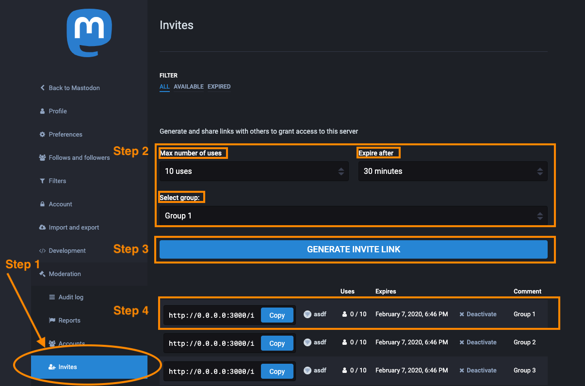
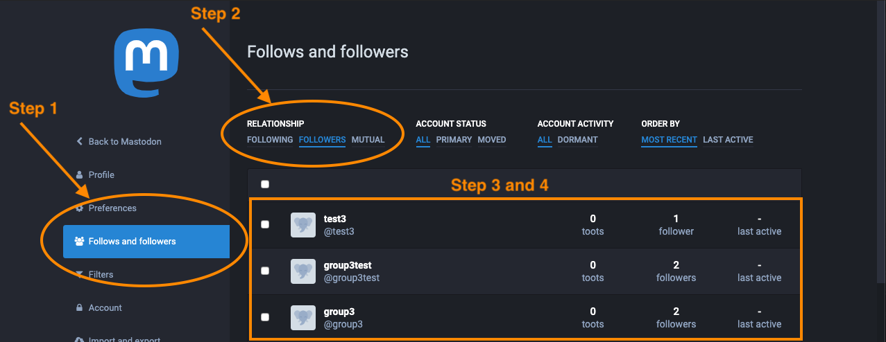

## Bridges Provisioning

_Follow this guide to create invite links and get groups set up for the Bridges Pilot._

_If you experience any issues contact your admin and direct them to [Managing Moderators](./manageModerators.md) or send an angry email to [kgary@asu.edu](mailto:kgary@asu.edu)_ 😇

### Precheck

In order to create invite links you must have at least Moderator role. Follow the below to verify you have the the correct privileges. 

* Login to [heal3.poly.asu.edu](https://heal3.poly.asu.edu) 
* Go to [`Preferences`](https://heal3.poly.asu.edu/admin/invites) 
* In the sidebar verify you have `Moderation`\
  
  
If you don't see your preferences page or don't see `Moderation` you are: 

  
Not a Moderator

  

  If you do not have access to Moderation, contact your admin or technical support contact provided above for assistance.    
### Provisioning 

Provisioning is intended to follow this work flow:

- Go to [`Preferences > Moderation > Invites` ](https://heal3.poly.asu.edu/admin/invites)
- Set the values for:

| Name  | Description  |   
|---|---|
| Max number of users  | the max number of people who can use the invite link  |
| Expire after | the amount of time before the link expires  |
| Select group | the group that all users of the link will automatically join (if you are a group leader, make sure you are creating a link for your group). | 

- Click `Generate Invite Link`.
- Verify the link is correct and copy it. 
- Share the link with group members and assist them with filling out the registration form online.

example: 

### Verify success

- Once the link has been created and all users have registered, go to `Preferences > Follows and follwers`.
- From there, under `Relationship` click on `Followers`
- Verify all the new users are following you.
- Verify that each users has the same amount of followers.  
 _Note: if any user logged out while other users registered the numbers may not perfectly match, however, when they log back in it will automatically update_ 

example:  

